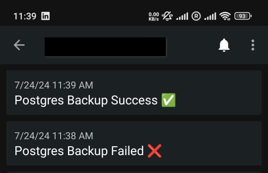

# NTFY 
It is a notification service that can send notifications to your phone and chrome.
https://ntfy.sh/
 ### Use Case
 - Get notified eg. "Release Successful" or "Release Failed" after a build is done.
 - Get status of your server as a daily notification.  
 
 - Get you recurring activity status.  
 

# UptimeKuma
It is a self-hosted monitoring tool that provides a simple interface to monitor your services.It can notify you about your service status via.
- Email
- Slack
- Discord
- Telegram
- Ntfy
  

